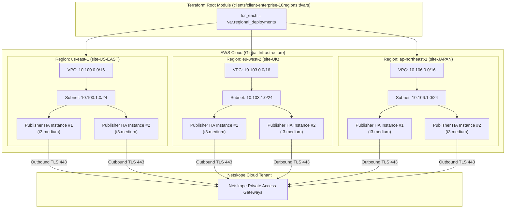
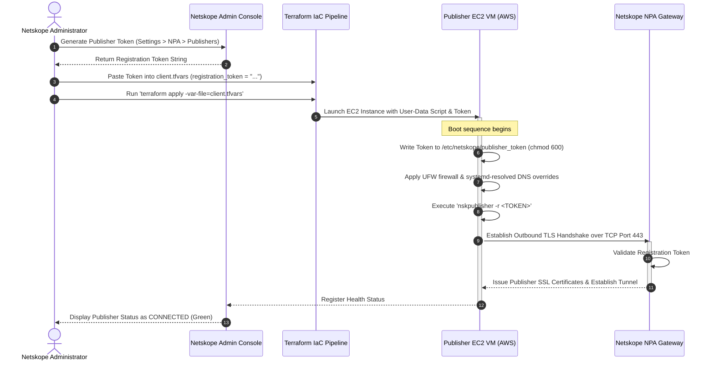

# Netskope Multi-Region Publisher Deployment Framework

A modular, enterprise-grade Infrastructure as Code (IaC) framework built with **Terraform** to automate the multi-region deployment, high availability (HA) pairing, and security hardening of **Netskope Private Access (NPA) Publishers** across global AWS cloud environments for multiple enterprise clients.

---

## 1. Problem Statement

Organizations adopting Secure Access Service Edge (SASE) and Zero Trust Network Access (ZTNA) with Netskope Private Access (NPA) face several operational challenges when onboarding hybrid cloud environments:

* **Manual Portal & Infrastructure Friction:** Manually deploying EC2 instances across multiple AWS regions and registering Publishers in the Netskope Admin Portal creates human error and inconsistent security postures.
* **Lack of Multi-Tenant Scalability:** Standard deployment scripts are often hardcoded to a single VPC or single region, making it difficult for managed service providers (MSPs) and enterprise architects to onboard multi-national clients requiring 2, 5, or 10+ regions simultaneously.
* **Security & Hardening Discrepancies:** Out-of-the-box virtual appliance deployments often miss enterprise-mandated host security controls, such as host-level firewalls (UFW), SNMPv3 monitoring, and DNS hijacking protections.

**Solution:** This framework provides a zero-code-modification engine where any number of regional Publisher HA pairs can be defined, hardened, and deployed across AWS regions instantly using client-specific configuration maps.

---

## 2. Architecture & Design

The framework leverages a **Root Orchestration Layer** combined with a **Reusable Regional Publisher Module**. It uses a map-driven `for_each` pattern to dynamically instantiate isolated VPCs, subnets, internet gateways, security groups, and Publisher EC2 HA pairs per region.



---

## 3. Publisher Token Workflow & Lifecycle

The Netskope Publisher Registration Token is a cryptographic, single-use bootstrap key generated inside your Netskope Tenant Admin Console (*Settings > Private Access > Publishers > Add Publisher*). It securely binds newly launched EC2 VMs to your Netskope tenant without embedding permanent administrative credentials inside the VM image.

### End-to-End Registration & Boot Sequence



### Detailed Token Processing Steps:
1. **Token Ingestion:** The token string is provided in the client configuration (`client.tfvars`).
2. **Template Interpolation:** Terraform injects the sensitive token variable into the EC2 launch user-data template (`publisher_user_data.sh.tftpl`).
3. **Automated Instance Boot:** When the AWS EC2 Publisher boots up:
   * It stores the token at `/etc/netskope/publisher_token` with `0600` root-only permissions.
   * Executes the `nskpublisher -r <TOKEN>` registration command.
4. **Cloud Tunnel Establishment:** The Publisher opens outbound connections over **TCP Port 443** to the Netskope Cloud Gateways, completes certificate issuance, and transitions into a **Connected** status in the Netskope Tenant Admin Console.

---

## 4. Components & Repository Layout

```text
Netskope_Multi-Region_Publisher_Deployment_Framework/
├── README.md                                 # Primary Architecture & Operational Guide
├── versions.tf                               # Provider & Terraform Version Locking
├── providers.tf                              # AWS Provider Setup
├── variables.tf                              # Global Input Variables & Topology Defaults
├── main.tf                                   # Root Orchestrator (Loops over regional map)
├── outputs.tf                                # Consolidated Deployment Summary & IP Maps
├── clients/
│   ├── client-standard-2regions.tfvars       # Sample 2-Region Client Configuration
│   └── client-enterprise-10regions.tfvars    # Sample 10-Region Enterprise Configuration
└── modules/
    └── regional_publisher/
        ├── main.tf                           # Regional VPC, Subnet, IGW, SG & EC2 Instances
        ├── variables.tf                      # Regional Input Schema
        ├── outputs.tf                        # Regional Infrastructure Outputs
        └── templates/
            └── publisher_user_data.sh.tftpl  # Auto-registration, SNMPv3, Netplan & UFW Hardening
```

---

## 5. Prerequisites

Before deploying the framework, ensure you have the following prerequisites in place:

1. **Terraform CLI:** Version `v1.5.0` or higher installed (Tested on `v1.15.8`).
2. **AWS Credentials:** Configured AWS CLI access with permissions to manage EC2, VPC, Subnets, Internet Gateways, Route Tables, and Security Groups (`aws configure` or `AWS_ACCESS_KEY_ID` / `AWS_SECRET_ACCESS_KEY` environment variables).
3. **AWS SSH Key Pair:** An existing EC2 Key Pair name in target regions (default: `Key_test`).
4. **Netskope Registration Tokens:** One registration token generated per Publisher site from your Netskope Tenant Admin Console (*Settings > Private Access > Publishers*).

---

## 6. Configuration & Multi-Tenant Scaling

The framework achieves multi-tenant scaling without modifying core code by passing client-specific `.tfvars` files to the `regional_deployments` map.

### 2-Region Client Example (`clients/client-standard-2regions.tfvars`)
```hcl
environment = "production-standard"
key_name    = "Key_test"

regional_deployments = {
  "site-US" = {
    region                  = "us-east-1"
    vpc_cidr                = "10.0.0.0/16"
    public_subnet_cidr      = "10.0.1.0/24"
    publisher_instance_type = "t3.medium"
    publisher_count         = 2
    registration_token      = "TOKEN_SITE_US"
  },
  "site-UK" = {
    region                  = "eu-west-2"
    vpc_cidr                = "10.1.0.0/16"
    public_subnet_cidr      = "10.1.1.0/24"
    publisher_instance_type = "t3.medium"
    publisher_count         = 2
    registration_token      = "TOKEN_SITE_UK"
  }
}
```

### 10-Region Client Scaling Example (`clients/client-enterprise-10regions.tfvars`)
To scale to **10 regions**, append additional site blocks in the `.tfvars` file. The root module automatically provisions all 10 regions concurrently:

```hcl
environment = "production-enterprise"
key_name    = "enterprise-prod-key"

regional_deployments = {
  "site-US-EAST"   = { region = "us-east-1",      vpc_cidr = "10.100.0.0/16", public_subnet_cidr = "10.100.1.0/24", publisher_instance_type = "t3.medium", publisher_count = 2, registration_token = "TOKEN_US_EAST" },
  "site-US-WEST"   = { region = "us-west-2",      vpc_cidr = "10.101.0.0/16", public_subnet_cidr = "10.101.1.0/24", publisher_instance_type = "t3.medium", publisher_count = 2, registration_token = "TOKEN_US_WEST" },
  "site-CANADA"    = { region = "ca-central-1",   vpc_cidr = "10.102.0.0/16", public_subnet_cidr = "10.102.1.0/24", publisher_instance_type = "t3.small",  publisher_count = 2, registration_token = "TOKEN_CANADA" },
  "site-UK"        = { region = "eu-west-2",      vpc_cidr = "10.103.0.0/16", public_subnet_cidr = "10.103.1.0/24", publisher_instance_type = "t3.medium", publisher_count = 2, registration_token = "TOKEN_UK" },
  "site-GERMANY"   = { region = "eu-central-1",   vpc_cidr = "10.104.0.0/16", public_subnet_cidr = "10.104.1.0/24", publisher_instance_type = "t3.medium", publisher_count = 2, registration_token = "TOKEN_GERMANY" },
  "site-FRANCE"    = { region = "eu-west-3",      vpc_cidr = "10.105.0.0/16", public_subnet_cidr = "10.105.1.0/24", publisher_instance_type = "t3.small",  publisher_count = 2, registration_token = "TOKEN_FRANCE" },
  "site-JAPAN"     = { region = "ap-northeast-1", vpc_cidr = "10.106.0.0/16", public_subnet_cidr = "10.106.1.0/24", publisher_instance_type = "t3.medium", publisher_count = 2, registration_token = "TOKEN_JAPAN" },
  "site-SINGAPORE" = { region = "ap-southeast-1", vpc_cidr = "10.107.0.0/16", public_subnet_cidr = "10.107.1.0/24", publisher_instance_type = "t3.medium", publisher_count = 2, registration_token = "TOKEN_SINGAPORE" },
  "site-INDIA"     = { region = "ap-south-1",     vpc_cidr = "10.108.0.0/16", public_subnet_cidr = "10.108.1.0/24", publisher_instance_type = "t3.medium", publisher_count = 2, registration_token = "TOKEN_INDIA" },
  "site-BRAZIL"    = { region = "sa-east-1",      vpc_cidr = "10.109.0.0/16", public_subnet_cidr = "10.109.1.0/24", publisher_instance_type = "t3.small",  publisher_count = 2, registration_token = "TOKEN_BRAZIL" }
}
```

---

## 7. Deployment Execution Guide

### Step 1: Initialize Working Directory
```bash
cd "/Users/luvahuja/Desktop/Netskope Project/Netskope_Multi-Region_Publisher_Deployment_Framework"
terraform init
```

### Step 2: Validate Syntax & Configuration
```bash
terraform validate
```

### Step 3: Execute Dry-Run Plan
Review planned resources for a specific client:
```bash
terraform plan -var-file=clients/client-standard-2regions.tfvars
```

### Step 4: Provision Infrastructure
Deploy resources to AWS:
```bash
terraform apply -var-file=clients/client-standard-2regions.tfvars -auto-approve
```

---

## 8. Test Plan & Operational Verification

Following deployment, execute this 4-step validation checklist:

### Test Case 1: AWS Infrastructure Verification
* **Check:** Verify VPC, Subnet, Internet Gateway, and EC2 instances state in AWS Management Console.
* **Expected Result:** EC2 instances are in `running` state with attached Public Elastic IPs across all target regions.

### Test Case 2: Outbound Tunnel Connectivity
* **Check:** SSH into Publisher instance and verify outbound connectivity to Netskope Cloud Gateways over TCP Port 443.
  ```bash
  ssh -i ~/.ssh/Key_test.pem ubuntu@<PUBLISHER_PUBLIC_IP>
  nc -zv gateway.netskope.com 443
  ```
* **Expected Result:** `Connection to gateway.netskope.com 443 port [tcp/https] succeeded!`

### Test Case 3: Netskope Portal Registration Status
* **Check:** Navigate to Netskope Tenant Admin Console under **Settings > Private Access > Publishers**.
* **Expected Result:** Every deployed Publisher instance displays a **Connected** (Green) status with matching private IP address.

### Test Case 4: Security Hardening Verification
* **Check:** Inspect local host firewall and DNS overrides on the Publisher VM:
  ```bash
  sudo ufw status verbose
  systemctl status systemd-resolved
  ```
* **Expected Result:** UFW is active with default deny incoming / allow outgoing, and `systemd-resolved` uses defined DNS servers.
